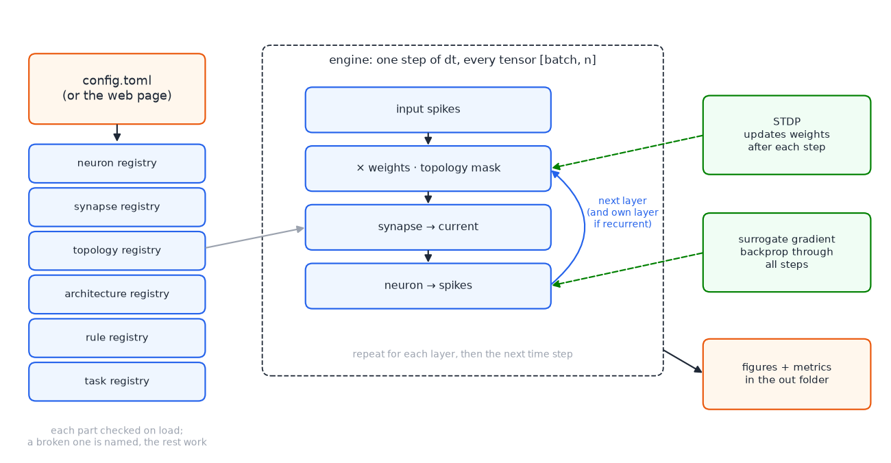
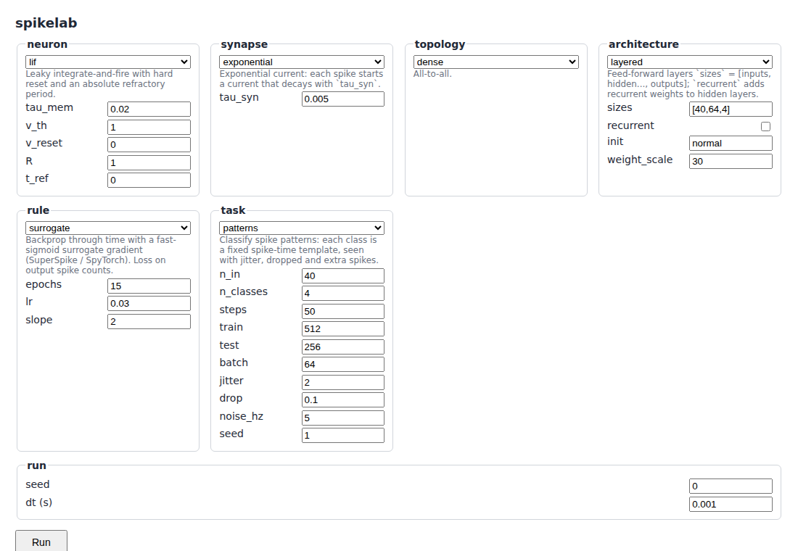
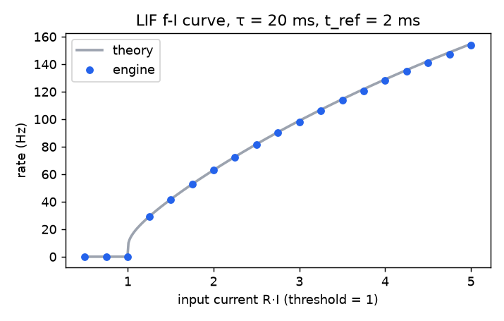
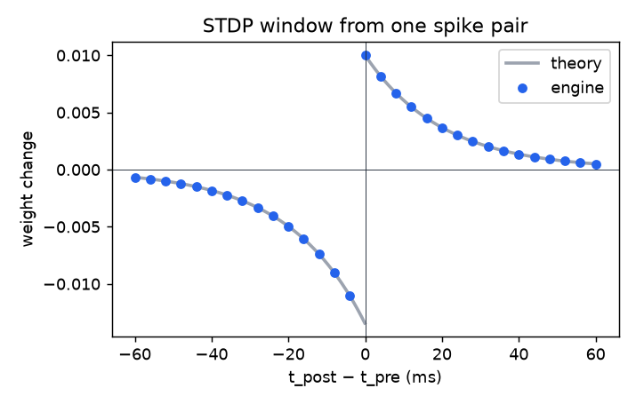
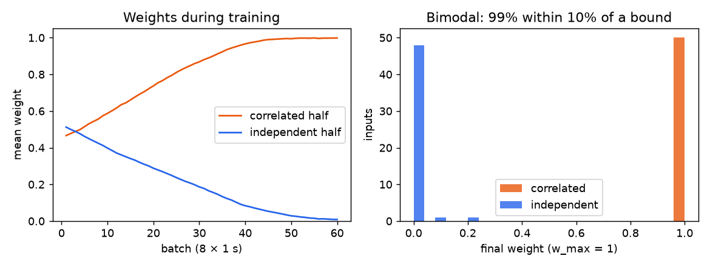
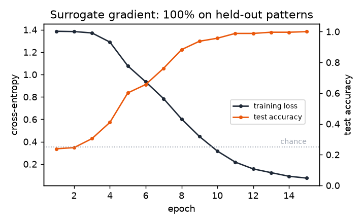

# spikelab guide

spikelab is a small workbench for spiking neural networks. You describe an experiment in one TOML file: which neuron, which synapse, how the layers connect, how big they are, and how the network learns. `spikelab run` trains it and draws the result. `spikelab serve` puts the same file behind a web page with dropdowns and a Run button.

It runs on the CPU with PyTorch. Every run in this guide takes under a minute.

## How it fits together



The engine steps a clock of fixed size `dt` (1 ms by default). Every tensor is shaped `[batch, n]`. On each step, each layer takes the spikes coming in, multiplies them by its weights (with the topology's mask), passes that through the synapse to get a current, and feeds the current to the neuron. The neuron's spikes go to the next layer. A recurrent layer also gets its own spikes from the step before.

The engine does not know which neuron, synapse, topology, architecture or rule it is running. Each of those is a class in a registry, picked by name in the config. When a class registers, it is checked against a small contract for its kind. If it fails, it is listed as broken with the reason, and everything else still works. `spikelab list` shows what is registered and what is broken.

## Changing each part

Each part is a table in the config with a `name` and that part's parameters. Anything you leave out takes its default. A parameter the part does not have is an error that names the part. See `configs/surrogate.toml` and `configs/stdp.toml`.

**Neuron** (`[neuron]`). `lif` is leaky integrate-and-fire with a hard reset and a refractory period (`tau_mem`, `v_th`, `v_reset`, `R`, `t_ref`). `adlif` adds an adaptive threshold: each spike raises it by `b`, and it relaxes back with `tau_adapt`, so a neuron under steady input slows down. The voltage has no units: rest is 0 and threshold is 1.

**Synapse** (`[synapse]`). `delta` delivers each spike's current in the same step. `exponential` spreads it over time with `tau_syn`. Both deliver the same total charge, so switching changes the timing, not the strength. One weight unit is a current: a spike of weight `w` through a `delta` synapse moves the membrane by about `w·dt/tau_mem`, so with the defaults a weight of 20 is roughly one threshold.

**Topology** (`[topology]`). `dense` connects everything. `sparse` keeps each connection with probability `p`.

**Architecture** (`[architecture]`). `layered` takes `sizes = [inputs, hidden..., outputs]` and `recurrent = true/false` (recurrent weights on hidden layers). `init` is `normal` (zero mean, scaled by fan-in, for gradient training) or `uniform` (0 to `weight_scale`, for STDP). `sizes[0]` must match the task's inputs.

**Learning rule** (`[rule]`).
- `stdp` is pair STDP with traces. Each input and each neuron keeps a trace that jumps by 1 at a spike and decays with `tau_plus` or `tau_minus`. A post spike adds `A_plus` times the input's trace; an input spike subtracts `A_minus` times the neuron's trace. Weights stay in `[0, w_max]`. It trains the feed-forward weights, online, as the network runs.
- `surrogate` is backprop through time. A spike is a step function, so its true gradient is zero almost everywhere and training stalls. The forward pass keeps the real step; the backward pass pretends its slope is a fast sigmoid, `1/(slope·|v − v_th| + 1)²`, as in Zenke's SuperSpike and SpyTorch. The loss is cross-entropy on the output layer's spike counts.

**Task** (`[task]`) is where the input comes from. `patterns` is labelled: each class is a fixed spike-time template, seen with jitter, missing spikes and extra noise spikes. `correlated` has no labels: Poisson inputs where the first half share a common source.

**Your own part.** Write a class, decorate it with `@register("neuron", "mine")`, put it in a file and add `plugins = ["my_neuron.py"]` at the top of the config. The contracts are in `spikelab/contracts.py`; the built-ins show the shape.

## Using it

```
spikelab run configs/surrogate.toml     # figures in out/surrogate/
spikelab serve                          # http://127.0.0.1:8765/
```

A run writes four figures: a spike raster, membrane traces, the first layer's weights, and the learning curve. It also writes `metrics.json` and the full config it ran, defaults filled in.

The web page reads the registries, so a new part shows up in its dropdown by itself, and a broken one shows with its reason. Change anything, press Run, and the four figures appear on the page. The TOML of that run is at the bottom, ready to save and rerun. The page listens on 127.0.0.1 only and refuses requests for any other host name.



## Checked against known results

Each of these is a test in `tests/test_correctness.py`. The figures come from `scripts/make_figures.py`.

**LIF f-I curve.** One LIF per input current, 1 s at `dt` = 0.1 ms, against the analytic rate `1/(t_ref + tau·ln(RI/(RI − v_th)))`. The test requires every period to be within one time step of theory, which is the most a fixed clock can do.



**STDP window.** One pre and one post spike at each time difference, run through the real rule. The change matches `A_plus·exp(−Δt/tau_plus)` for Δt ≥ 0 and `−A_minus·exp(Δt/tau_minus)` for Δt < 0 to 1e-7. A pre spike in the same step as the post spike counts as causal, because it was part of the input that made the neuron fire.



**STDP finds the correlated inputs.** One neuron, 100 Poisson inputs at 20 Hz, the first 50 sharing a source (c = 0.3), as in Song, Miller and Abbott (2000). Depression is a little stronger than potentiation, so random coincidences lose. The correlated inputs cause spikes together and win. The weights split to the two bounds. The test requires means above 0.8 and below 0.2, and more than 80% of weights within 10% of a bound.



**Surrogate gradient learns patterns.** 40 inputs, 64 hidden LIF neurons, 4 outputs, four spike-time classes. 512 training samples, 256 held out. Chance is 25%. The test requires more than 90% on the held-out set; it reaches 100% in 15 epochs.



## What is next

- **e-prop.** Surrogate BPTT keeps every time step in memory to go backwards. e-prop (Bellec et al., 2020) uses the same surrogate but learns online with eligibility traces, so long runs and on-chip learning become possible. It fits as one more rule.
- More neurons (Izhikevich, conductance synapses), delays, and inhibitory populations.
- STDP variants: multiplicative weights, triplet STDP, reward-modulated STDP.
- Real data such as spiking MNIST or SHD, once downloads are agreed.
- Putting the page on a public hostname behind the box's sign-in. That needs the owner's approval.
